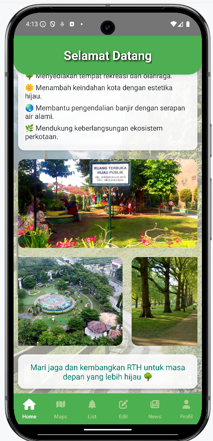
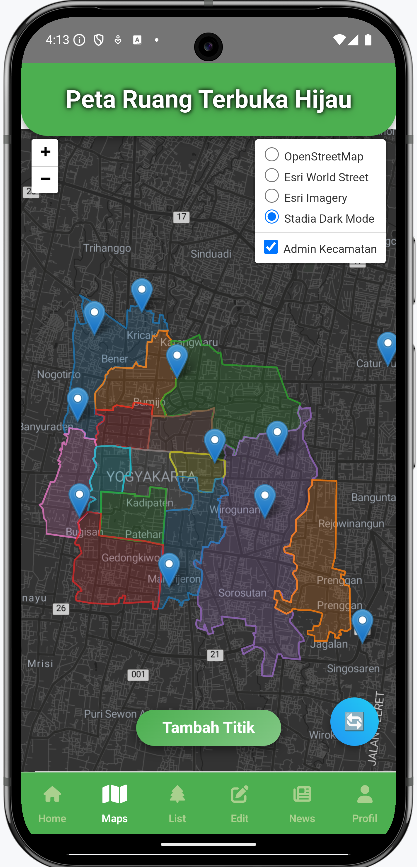

# 🌿 **Sebaran Ruang Terbuka Hijau Publik di Kota Yogyakarta, DIY** 🌍

**🎯 Tujuan Aplikasi:**  
Aplikasi *Sebaran Ruang Terbuka Hijau Publik di Kota Yogyakarta* bertujuan untuk mempermudah warga Yogyakarta dan pengunjung dalam mengakses informasi tentang **Ruang Terbuka Hijau (RTH)** yang ada di kota ini. Menyediakan data lokasi, fasilitas, dan rating RTH yang dapat diakses kapan saja dan di mana saja.

---

## 🌟 **Latar Belakang**  
Kota Yogyakarta, sebagai kota yang terkenal dengan kebudayaan dan pariwisatanya, juga memiliki berbagai **Ruang Terbuka Hijau (RTH)** yang penting bagi kualitas hidup. Namun, data tentang lokasi dan fasilitas RTH sering tersebar dan tidak terorganisir dengan baik. Aplikasi ini hadir untuk menyelesaikan masalah tersebut dengan menyediakan **akses cepat** dan **informasi terstruktur** tentang RTH yang ada di kota Yogyakarta.

---

## 🏙️ **Masalah yang Dihadapi**
Banyak masyarakat kesulitan mencari **informasi akurat** tentang lokasi RTH terdekat, fasilitas yang ada, atau bahkan tidak tahu ada RTH di sekitar mereka. Aplikasi ini membantu mengatasi masalah tersebut dengan menyediakan data yang **terorganisir dan mudah diakses**.

---

## 🚀 **Fitur Utama Aplikasi**  
Aplikasi ini dilengkapi dengan berbagai fitur yang dirancang untuk memberikan pengalaman terbaik bagi penggunanya. Berikut adalah fitur-fitur utama:

### 1. **🏠 Homescreen**  
Halaman utama aplikasi menampilkan daftar RTH yang dapat disortir berdasarkan:
- **Pendahuluan**
- **Tentang RTH**  
- **Kelebihan**  

 
 

### 2. **🗺️ Tampilan Peta & Marker**  
- Peta interaktif menampilkan lokasi RTH dengan **marker** yang dapat diklik.
- **Popup** pada setiap marker menunjukkan informasi lengkap seperti nama, rating, alamat, dan jam operasional.
- Pengguna dapat melihat rute menuju lokasi RTH menggunakan **Google Maps**.

 
 

### 3. **➕ Fitur Tambah Titik & Marker**  
- Pengguna atau pengelola RTH dapat **menambahkan lokasi RTH baru** dengan mengisi informasi terkait.
- Setelah penambahan, **marker** baru akan muncul di peta dengan data lengkap.

 
 
 

### 4. **📋 List Data RTH**  
- Daftar terstruktur RTH yang dapat dengan mudah dicari dan difilter berdasarkan kategori atau lokasi.
- Setiap RTH memiliki informasi lengkap tentang gambar, alamat, fasilitas, rating, dan jam operasional.

 
 

### 5. **✏️ Edit Data RTH**  
Pengelola atau pengguna dengan hak akses dapat memperbarui:
- **Fasilitas baru**
- **Alamat Fasilitas**
- **Jam Operasional**

 
 

### 6. **👤 Profil Screen**  
Halaman profil memungkinkan pengguna untuk:
- Melihat informasi pribadi mereka

 

### 7. **📰 Halaman Berita Terbaru**  
- Pengguna dapat melihat informasi terkait **berita terbaru** seputar ruang terbuka hijau di Yogyakarta.
- Halaman ini menampilkan berita yang relevan dengan **update terkini** dan pengelolaan RTH di kota Yogyakarta.

---

## 🎬 **Demo Singkat Aplikasi**  
- **Homescreen:** Pengguna membuka aplikasi dan langsung melihat daftar RTH yang dapat disortir.  
- **Peta:** Lihat lokasi RTH dengan **marker** yang berisi informasi lengkap dan gambar.  
- **Navigasi:** Dapatkan **rute terbaik** menuju RTH menggunakan Google Maps.  
- **Tambah Titik:** Jika menemukan RTH baru, pengguna dapat **menambahkannya** dengan informasi lengkap.

---

## 🌱 **Kenapa Aplikasi Ini Dibuat?**  
Aplikasi ini dibuat untuk mempermudah akses informasi mengenai **RTH di Kota Yogyakarta**, mempercepat proses pencarian, dan membantu pengguna dalam menemukan RTH yang sesuai dengan kebutuhan mereka. Dengan partisipasi aktif masyarakat, aplikasi ini juga mendukung **keberlanjutan lingkungan** dan **perawatan RTH** di kota ini.

---

## 🎨 **Desain yang Menarik**  
Aplikasi ini menggunakan **ikon-ikon intuitif** dan desain visual yang **berwarna-warni** dengan gradasi warna yang membuat navigasi lebih mudah dan menyenangkan. Setiap fitur dilengkapi dengan gambar dan ikon yang memudahkan pengguna dalam memahami fungsinya.

---

## ⚙️ **Komponen Pembangun Aplikasi**  

Aplikasi ini terdiri dari beberapa komponen yang bekerja **bersama-sama** untuk menciptakan pengalaman yang optimal bagi pengguna:

### 1. **React Native** 📱
Aplikasi ini dibangun menggunakan **React Native**, framework JavaScript yang memungkinkan pembuatan aplikasi mobile untuk **Android** dan **iOS** dengan **kode yang sama**. React Native menjamin tampilan yang responsif dan performa yang **baik**.

### 2. **React Navigation** 🧭
Untuk mengelola navigasi antar halaman aplikasi, digunakan **React Navigation**. Fitur ini mempermudah pengguna untuk berpindah antara:
- **Homescreen**
- **Profil Screen**
- **Detail RTH**
- **Peta Interaktif**

### 3. **API untuk Data RTH** 🌐
Data RTH dikelola melalui **API Backend** yang menyediakan informasi terkait nama RTH, alamat, rating, jam operasional, dan gambar dalam format **JSON**.

### 4. **Google Maps API** 🗺️
Untuk menampilkan peta interaktif, digunakan **Google Maps API**. Setiap lokasi RTH akan ditandai dengan **marker** dan dapat menunjukkan rute menuju tempat tersebut.

### 5. **State Management** 📊
State aplikasi dikelola dengan **useState** dan **useEffect** dari React. Data seperti **status loading**, **data RTH**, dan **status halaman aktif** dikelola dengan efisien untuk memberikan pengalaman pengguna yang responsif.

### 6. **React Native Components** 🧩
Komponen-komponen seperti **Text**, **FlatList**, **TouchableOpacity**, **TextInput**, dan **Image** digunakan untuk menampilkan data dan interaksi pengguna. Beberapa **ikon eksternal** juga digunakan untuk meningkatkan tampilan, seperti **FontAwesomeIcon**.

---

## 🚧 **Alur Pembuatan Produk**  

Proses pembuatan aplikasi ini melalui beberapa tahap yang dimulai dari perencanaan hingga deploy ke store:

### 1. **Desain UI/UX** 🎨
- Merancang layout aplikasi dengan **wireframe** atau **mockup**.
- Desain antarmuka Homescreen yang menampilkan daftar RTH, fitur pencarian, dan akses ke peta.
- Desain halaman **Profil Screen** untuk pengaturan informasi pengguna.

### 2. **Pengembangan Fitur Utama** 🔧
- **Homescreen**: Menampilkan daftar RTH dengan fitur pencarian dan filter menggunakan **FlatList**.
- **Detail RTH & Peta Interaktif**: Menampilkan informasi RTH dan lokasi di peta dengan **marker**.
- **Tambah Titik**: Pengguna atau pengelola dapat menambah lokasi RTH baru.
- **Edit Data**: Pengelola dapat memperbarui data RTH yang sudah ada.

### 3. **Integrasi API dan Backend** 🔗
- Aplikasi terhubung ke API backend untuk **mengambil** dan **mengelola** data RTH menggunakan metode **CRUD** (Create, Read, Update, Delete).

### 4. **Integrasi Google Maps API** 🗺️
- **Marker** ditambahkan pada peta interaktif untuk setiap lokasi RTH.
- Setiap marker dapat menampilkan **popup** dengan gambar dan informasi lebih lanjut.
- Pengguna dapat mendapatkan **rute perjalanan** ke RTH menggunakan **Google Maps**.

### 5. **Testing dan Debugging** 🧪
- Setelah pengembangan selesai, aplikasi diuji di berbagai perangkat (Android dan iOS) untuk memastikan tampilan dan fungsionalitas berjalan dengan lancar tanpa bug.

---

## 📝 **Source Code Pembangun Aplikasi**

Source code aplikasi ini dibagi ke dalam beberapa file penting:

### 1. **Component Files** 💻
- **Homescreen.js**: Menampilkan daftar RTH dan fitur pencarian.
- **DetailRth.js**: Menampilkan detail lengkap RTH dengan informasi tambahan dan peta.
- **ProfileScreen.js**: Menampilkan informasi profil pengguna dan pengaturan.
- **MapView.js**: Menampilkan peta interaktif dengan marker dan popup gambar.

### 2. **API Integration** 🔄
- Menggunakan **fetch** atau **Axios** untuk mengambil data dari API dan mengelola response data.

### 3. **State Management** 📊
- **useState** dan **useEffect** digunakan untuk menyimpan dan mengelola data sementara seperti status loading dan hasil pencarian.

### 4. **Google Maps Integration** 🌍
- Menggunakan **Google Maps SDK** untuk menampilkan peta dan marker yang dapat diklik, menampilkan popup gambar dan informasi RTH.

### 5. **UI Components** 🎨
- React Native menggunakan **komponen dasar** seperti **TouchableOpacity** untuk interaksi pengguna, **FlatList** untuk menampilkan daftar, dan **TextInput** untuk pencarian, serta **Image** untuk menampilkan gambar di marker atau popup.

---

## 🎯 **Kesimpulan**  
Aplikasi *Sebaran Ruang Terbuka Hijau Publik di Kota Yogyakarta* menggabungkan berbagai teknologi dan komponen untuk memberikan informasi yang **interaktif**, **mudah diakses**, dan **reliable** bagi masyarakat. Dengan menggunakan **React Native**, **Google Maps API**, dan manajemen state yang efisien, aplikasi ini dapat memberikan pengalaman yang **cepat**, **responsif**, dan **informasi yang up-to-date**.

**Bergabunglah dengan kami untuk menjaga kelestarian Ruang Terbuka Hijau di Kota Yogyakarta!** 🌿🌍

---

## 🌐 **Hubungi Kami**  
Untuk pertanyaan lebih lanjut, hubungi email di [[muhammadnashanfauzian1404@mail.ugm.ac.id](https://mail.google.com/mail/u/0/#inbox)] atau kunjungi instagram di [[@son.tolo.yo](https://www.instagram.com/son.tolo.yo)].  
**Ikuti kami di media sosial** untuk mendapatkan update terbaru tentang RTH di Kota Yogyakarta!

---

🌱 **Terima Kasih telah menggunakan aplikasi ini!** 😊